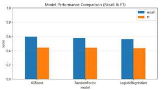
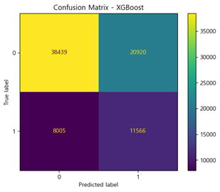
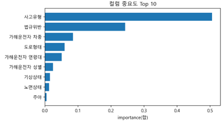
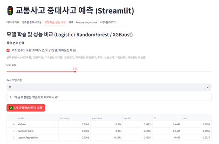

# 교통사고 중대사고 예측 (Machine Learning)

교통사고 데이터를 활용해 **중대사고(중상·사망) 발생 여부**를 예측하는 머신러닝 프로젝트입니다.  
단순 정확도(Accuracy)가 아닌, **중대사고를 놓치지 않는 탐지 성능(Recall/F1)**에 초점을 맞춰 모델을 설계·평가했습니다.  
분석 전 과정을 **Streamlit 웹 앱**으로 구현하여 데이터 탐색부터 모델 학습·평가·예측까지 한 번에 수행할 수 있습니다.

---

## TL;DR
- **문제 정의**: 사고 발생 시점의 조건만으로 중대사고 발생 가능성 예측
- **핵심 설계**: 사고 이후 정보 제거 → **Data Leakage 방지**
- **모델**: Logistic Regression / Random Forest / XGBoost 비교
- **평가 기준**: Accuracy 대신 **Recall · F1 · AUC**
- **결론**: 중대사고 탐지 성능이 가장 안정적인 **XGBoost** 선택
- **결과물**: Streamlit 대시보드(성능 비교·해석·예측)

---

## Model Comparison (Recall / F1 / AUC)


> Accuracy 대신 Recall·F1·AUC 기준으로 모델을 비교하여,  
> **중대사고(중상·사망)를 놓치지 않는 성능**이 가장 안정적인 모델을 선택했습니다.

---

## Confusion Matrix


> 단순 정확도보다 **중대사고를 놓치지 않는 것(Recall)**에 초점을 두어  
> 실제 안전 정책 문제에 적합한 성능을 검증했습니다.

---

## Feature Importance


> 법규위반 유형, 사고유형, 도로 형태 등 주요 요인이  
> 중대사고 발생 가능성에 어떻게 기여하는지 모델 해석을 통해 확인했습니다.

---

## Streamlit Dashboard


> 데이터 탐색부터 모델 학습·평가·예측까지  
> 전체 분석 흐름을 웹 인터페이스로 구현했습니다.

---

## 주요 기능
- **데이터 전처리**: 23·24년 교통사고 CSV 정제 및 피처 엔지니어링
- **모델링**: 이진 분류(LR, RF, XGBoost)
- **평가**: Recall / F1 / AUC, Confusion Matrix
- **해석**: Feature Importance 기반 설명 가능성 확보
- **시각화**: Streamlit 대시보드

---

## 환경 요구사항
- Python 3.10+
- Windows 한글 시각화: Malgun Gothic 폰트

---

## 설치 및 실행
```bash
python -m venv .venv
.venv\Scripts\activate   # Windows
pip install -r requirements.txt
streamlit run app.py
